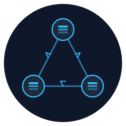

<p align="center">
  
</p>

<h1 align="center">cache-mesh</h1>

<p align="center">
  <a href="https://www.npmjs.com/package/cache-mesh"></a>
  <a href="https://github.com/ridakaddir/cache-mesh/actions/workflows/ci.yml"></a>
  <a href="https://github.com/ridakaddir/cache-mesh/blob/main/LICENSE"></a>
  <a href="https://www.npmjs.com/package/cache-mesh"></a>
</p>

<p align="center">
  Peer-to-peer in-memory cache replication for Node.js apps on Kubernetes.<br/>
  <strong>No broker. No sidecar. No new service component.</strong>
</p>

---

Each pod keeps its own in-memory cache (lru-cache, node-cache, Map, ...).
`cache-mesh` wraps that cache and replicates writes to every other pod via
HTTP, discovering peers through a headless Kubernetes Service. New pods
bootstrap a full snapshot from a random peer; concurrent writes are resolved
with a Hybrid Logical Clock (last-write-wins).

## Install

```bash
pnpm add cache-mesh
```

Node.js ≥ 18, ESM only.

## Quickstart

```ts
import { LRUCache } from 'lru-cache';
import { createCacheSync } from 'cache-mesh';

const cache = createCacheSync({
  store: new LRUCache({ max: 10_000 }),
  namespace: 'product-cache',
  auth: { hmacSecret: process.env.CACHE_MESH_KEY! },
  discovery: {
    type: 'dns',
    host: 'my-app-sync.default.svc.cluster.local',
  },
  port: 7073,
});

await cache.start();

cache.set('sku-42', { price: 9.99 }); // local write + broadcast
cache.get('sku-42');                  // local read
cache.delete('sku-42');               // tombstone + broadcast
```

## How it works

```
┌──────────── Pod A ────────────┐     ┌──────────── Pod B ────────────┐
│ your app                      │     │ your app                      │
│    ▼ cache.set('k', v)        │     │                               │
│ StoreWrapper (LWW via HLC)    │     │ StoreWrapper (LWW via HLC)    │
│    ▼ broadcasts to peers ─────┼─────┼─► HTTP server /sync/op        │
│ DNS discovery ◄───── headless Service A-records ─────► DNS          │
└───────────────────────────────┘     └───────────────────────────────┘
```

- **Discovery:** poll `dns.resolve4()` on a headless Service you own. Zero
  RBAC. Self-IP comes from `POD_IP` (downward API) or the primary interface.
- **Transport:** HTTP/1.1 with keep-alive via `undici`. HMAC-signed requests.
- **Bootstrap:** new pod pulls `GET /sync/snapshot` (NDJSON) from a random
  ready peer. First pod to join simply starts empty.
- **Conflicts:** every write carries a Hybrid Logical Clock timestamp; peers
  keep the higher one. Deletes leave a 5-minute tombstone.

## Kubernetes setup

Two Services are needed: your existing public one, and a **headless** one
for peer discovery.

`examples/k8s/headless-service.yaml`:

```yaml
apiVersion: v1
kind: Service
metadata:
  name: my-app-sync
spec:
  clusterIP: None
  selector: { app: my-app }
  ports: [{ name: sync, port: 7073, targetPort: sync }]
```

Pod spec highlights (`examples/k8s/deployment.yaml`):

```yaml
env:
  - name: POD_IP
    valueFrom: { fieldRef: { fieldPath: status.podIP } }
  - name: CACHE_MESH_HOST
    value: "my-app-sync.default.svc.cluster.local"
  - name: CACHE_MESH_KEY
    valueFrom: { secretKeyRef: { name: cache-mesh-secret, key: hmac } }
ports:
  - { name: http,  containerPort: 3000 }
  - { name: sync,  containerPort: 7073 }
readinessProbe:
  httpGet: { port: sync, path: /sync/health }
```

Generate the HMAC secret with `openssl rand -hex 32`.

## Next.js integration

Works with Next.js ≥ 13.4 on the Node runtime (Edge runtime is **not**
supported).

1. **`instrumentation.ts`** at the project root boots the coordinator once
   per server process:

   ```ts
   export async function register() {
     if (process.env.NEXT_RUNTIME !== 'nodejs') return;
     const { getCache } = await import('./src/lib/cache');
     await getCache().start();
   }
   ```

2. **Module-level singleton** via the provided helper — survives HMR and
   multiple module graphs (app router + pages router):

   ```ts
   import { LRUCache } from 'lru-cache';
   import { createCacheSync } from 'cache-mesh';
   import { getOrCreate } from 'cache-mesh/singleton';

   export const getCache = () =>
     getOrCreate('product-cache', () => createCacheSync({ /* … */ }));
   ```

3. **`next.config.ts`** — mark the package as external so Next.js does not
   bundle `undici` / `node:*`:

   ```ts
   const config = { serverExternalPackages: ['cache-mesh'] };
   ```

4. **Route handlers** must not use `export const runtime = 'edge'`.

5. Your k8s Deployment must expose **both** ports (`3000` for Next.js,
   `7073` for sync) and have the headless Service pointing at `7073`.

See `examples/nextjs-app/` for a full runnable example.

## API

```ts
createCacheSync<V>({
  store,          // { get, set, delete, has, entries, clear? }
  namespace,      // string — all peers must share this
  auth: { hmacSecret },
  discovery: {
    type: 'dns', host: 'my-app-sync....svc.cluster.local',
    // optional: intervalMs, selfIp
  } | {
    type: 'static', peers: [{ id, host, port }]
  } | {
    type: 'custom', discovery: /* your own */
  },
  port = 7073,
  host = '0.0.0.0',
  nodeId,                  // HLC tiebreaker; default: hostname + random
  tombstoneTtlMs = 300_000,
  bootstrapTimeoutMs = 10_000,
  requestTimeoutMs = 2_000,
  outboxCapacity = 1_000,  // per-peer retry buffer
  logger = 'silent',       // 'console' | 'silent' | Logger
  transport: {
    compression: { snapshot: 'gzip' },  // 'gzip' | false; default 'gzip'
    maxConnectionsPerPeer: 8,           // undici pool size per peer
    pipelining: 1,                      // undici in-flight depth per connection
  },
});
```

**Snapshot compression** is on by default — bootstrap responses are gzipped
when the requesting peer sends `Accept-Encoding: gzip` (the bundled client
always does). Old peers that ignore the header still receive raw NDJSON, so
mixed-version clusters work without coordination. Set
`transport.compression.snapshot: false` to send uncompressed NDJSON
(useful for `tcpdump`/`curl` debugging).

Returns `{ start, stop, get, has, set, delete, clear, peers, on, off }`.

**Events** (via `.on()`): `ready`, `sync:applied`, `sync:rejected`,
`peer:add`, `peer:remove`, `bootstrap:started`, `bootstrap:finished`,
`error`.

## What this is, and isn't

**Good for:**
- Read-heavy data with expensive origin fetch (reference data, feature
  flags, config, computed aggregates)
- Apps with 2–30 replicas per cluster
- "I wish I had Redis, but I don't want to run Redis"

**Not for:**
- Durable state (cache is in-memory; restart = cold)
- Strong consistency (this is last-write-wins, eventually consistent)
- Huge cardinality / multi-GB caches (every pod mirrors every key)
- Multi-cluster / cross-region replication
- Cross-language sync (Node.js only)

## Development

```bash
pnpm install
pnpm test          # unit + e2e (21 tests)
pnpm typecheck
pnpm build
```

## License

MIT
